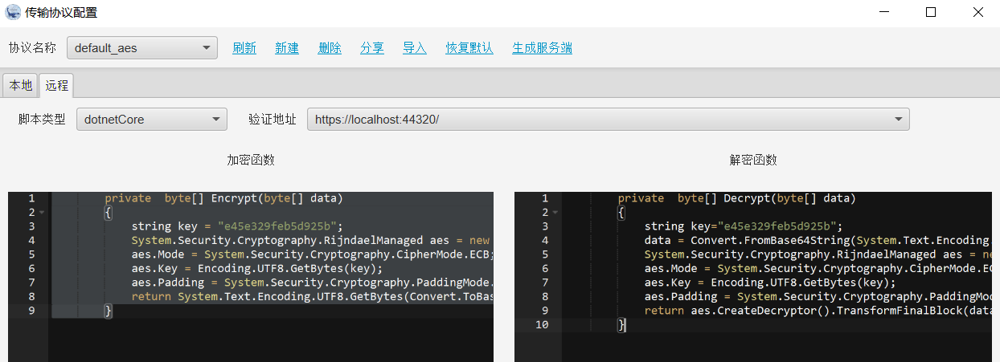
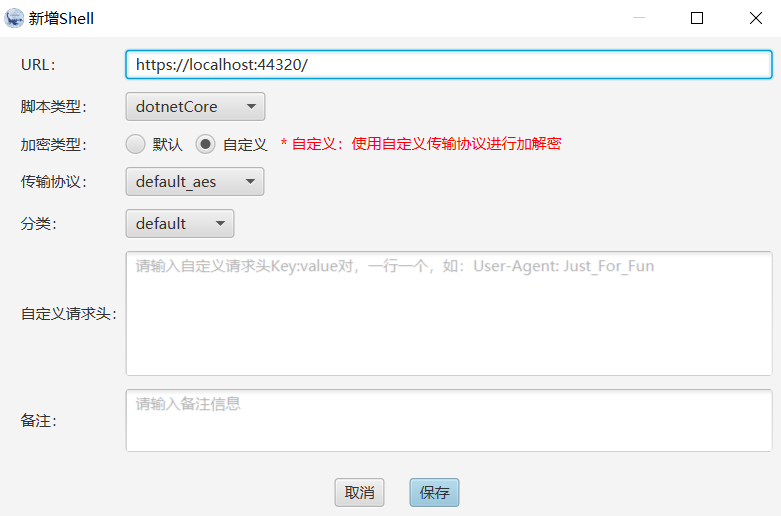

# Behinder-dotnet-Core-Payload
.net core implementation of Behinder Payload

- **Behinder**：冰蝎二开项目
- **MemShell**：[内存马实现](https://github.com/orzchen/Behinder-dotnet-Core-Payload/blob/main/dotnet%20Core%E4%B8%8B%E7%9A%84%E5%86%85%E5%AD%98%E9%A9%AC.md)
- **Payload**：冰蝎Payload在.Net Core上的实现

1. 使用VS 2022或者Rider编译Payload
2. 复制编译好的dll文件到目录`Behinder\src\main\resources\net\rebeyond\behinder\payload\dotnetCore`
3. 重新构建冰蝎，将[冰蝎](https://github.com/rebeyond/Behinder)作为库添加到项目/模块中，`data.db`中添加了一条Shell类型数据

Tips：这可能并不是一个通用方案，因为.net core版本之间存在不兼容情况，可能需要针对目标重新编译。

1. 冰蝎的数据库功能中切片上传数据库驱动时，没有对每个切片请求的返回内容进行提取导致解密失败（`net.rebeyond.behinder.core.ShellService#uploadFile`），以及在第一次连接Shell的时候使用数据库功能会使得当前Shell的信息中没有目标操作系统类型（数据库已经更新），如果目标是Windows，上传驱动的时候可能会导致目录错误（`net.rebeyond.behinder.ui.controller.DatabaseViewController#loadDriver`）

2. 添加了dotnetCore类型

3. 反弹shell在.net core中开辟内存来执行shellcode有问题

4. 数据库功能中Oracle数据库没有测试

